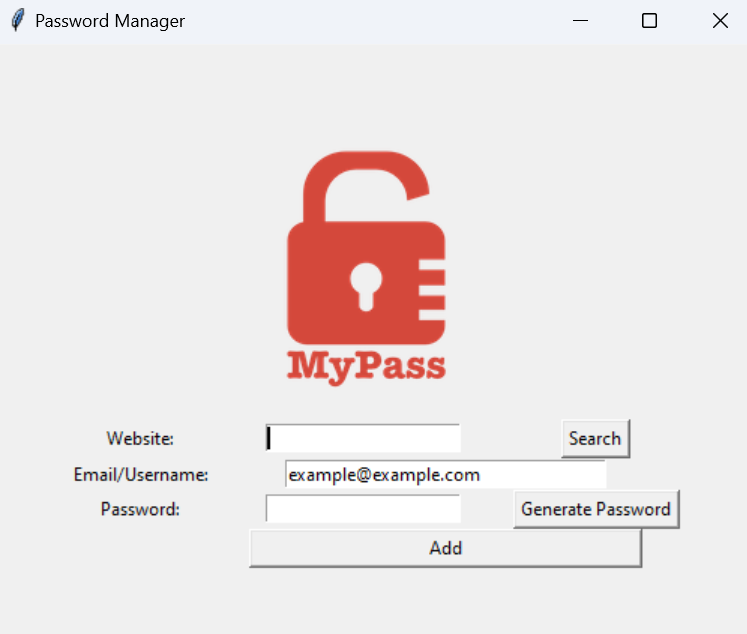
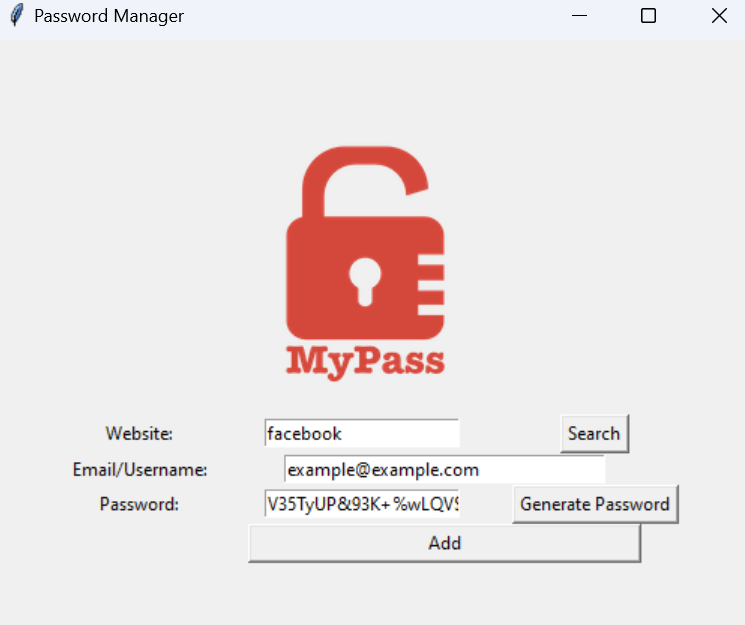
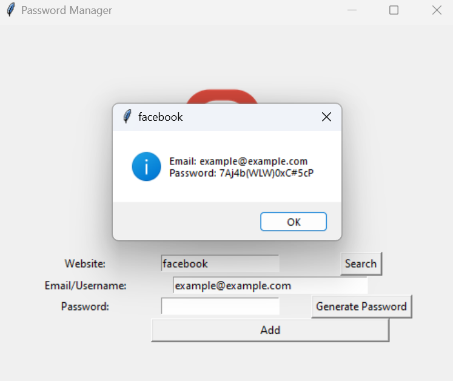

# Password Manager 🔒🗝️

The **Password Manager** is a secure and efficient tool designed to help you manage your passwords. It generates strong, unique passwords, stores them securely, and allows you to retrieve them when needed. With a user-friendly graphical interface built using Python's `tkinter` library, this application simplifies password management.

## 🚀 Features
- **Password Generation:**
  - Create strong and unique passwords using letters, numbers, and symbols.
  - Automatically copy generated passwords to the clipboard for convenience.
- **Secure Storage:**
  - Save passwords securely in a local `JSON` file.
  - Data is stored in a structured format for easy retrieval.
- **Quick Search:**
  - Instantly search for stored passwords by website name.
- **Reset and Focus:**
  - Automatically clear form fields after saving data for a seamless user experience.

## 🎮 How to Use
1. **Generate a Password:**
   - Click the "Generate Password" button to create a secure password.
2. **Save a Password:**
   - Enter the website, email/username, and generated password.
   - Click the "Add" button to save the details.
3. **Search for a Password:**
   - Enter the website name in the "Website" field and click "Search."
   - If found, the email and password for the website will be displayed.
4. **Reset Fields:**
   - Fields are reset automatically after saving or searching.

## 📷 Screenshots
### Main Interface:

### Password Generation:

### Search Results:

